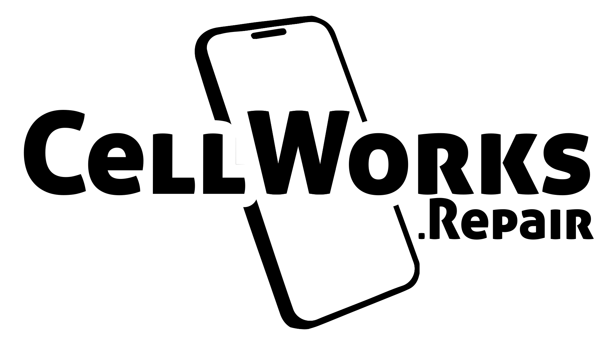

  

    <b>Collects data from specified websites and stores it within a Firebase RTD, which is used by the CellWorks Portal App.</b>

    Written using TypeScript, Node.js, Puppetmaster, and Firebase.

    
    

    

